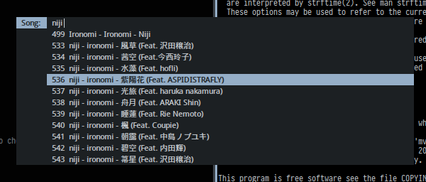

# Menu Suite

This is a collection of shell scripts that interface with either [dmenu](http://tools.suckless.org/dmenu/) or [fzf](https://github.com/junegunn/fzf). There are also an experimental perl rewrite in the `perl` directory.

Everyone's *nix setups are different. As such, these scripts fit my personal use case and it's not guaranteed to fit yours.

## Included Scripts

| Script             | Description
| --------------     | -----------
| brightnessmenu     | Set laptop monitor brightness.
| cpumenu            | Query and set system's enabled cpu profiles.
| dvdmenu            | Navigate dvd with mpv.
| i3windowSelect.py  | Jump-to-window/workspace in [i3](http://i3wm.org/) (dmenu only)
| infomenu           | Display some system information with acpi.
| killmenu           | Kill processes.
| menumenu           | Menu to select menus.
| monitormenu        | Setup (preconfigured, hardcoded) monitor layouts with xrandr.
| mpcmenu            | Interface for [mpd](http://www.musicpd.org/) using [mpc](http://linux.die.net/man/1/mpc).
| netmenu            | Wifi profile select using netctl.
| runmenu            | List and run programs in user's $PATH.
| shutdownmenu       | Shutdown, reboot, and sleep.
| wallpapermenu      | Set a wallpaper (using setroot) from a hardcoded directory. Need to implement selecting specific wallpapers for specific monitors.
| wmmenu             | Unfinished script to interact with wmctrl.

## Additional Perl Scripts

| Script             | Description
| --------------     | -----------
| MenuSuite.pm       | Perl module to manage menu making by using dispatch tables or simple list selection.
| brightness.pl      | Set laptop monitor brightness.
| cpugov.pl          | Query and set system's enabled cpu profiles.
| kill.pl            | Kill processes.
| menu.pl            | Menu to select menus (in this directory).
| mpc.pl             | Interface for [mpd](http://www.musicpd.org/) using [Net::MPD](https://metacpan.org/pod/Net::MPD).
| net.pl             | Wifi profile select using netctl.
| pwsafe.pl          | Interact with pwsafe (mostly by spawning a terminal with that process running).
| run.pl             | List and run programs in user's $PATH. Should have the same functionality as dmenu_run.
| shutdown.pl        | Shutdown, reboot, and sleep.

## Screenshot(s)

## Possible Usage

All scripts take a single optional argument to decide which backend to use. If this argument is excluded, dmenu is used by default. Backends supported: fzf, dmenu, and rofi.

Run mpcmenu (interface for mpd client) with dmenu:

    ~/bin/menu/scripts/mpcmenu dmenu

Run mpcmenu in a new terminal emulator ([urxvt](https://en.wikipedia.org/wiki/Rxvt-unicode) or [termite](https://github.com/thestinger/termite)) window with fzf:

    urxvt -name "fzf-menu" -geometry 80x24 -e $HOME/bin/menu/scripts/mpcmenu fzf
    termite --class "fzf-menu" --geometry 640x480 -e "$HOME/bin/menu/scripts/mpcmenu fzf"

We set an interface name for our urxvt window so we can allow a window manager to specifically manage these menus. For example, [bspwm](https://github.com/baskerville/bspwm) allows us to set rules for window interfaces:

    bspc rule -a fzf-menu floating=on,center=on,monitor=LVDS1,follow=on

With this, my fzf-enabled menus will be floating and centered on my laptop monitor. It will also focus itself if I run it from any other monitor.

A similar rule for i3 would be:

    for_window [class="^fzf-menu$"] floating enable, move output LVDS1

#### Note:

When spawning a new terminal to run the `runmenu` script (with fzf), it currently does not properly detach itself from its parent shell. So when the spawned terminal exits, the process started by `runmenu` will also exit.

## Xresources

If you choose to use dmenu, `lib/menu_helpers` has a `USE_DMENURC` flag if you choose to not use the Xresources database (or don't have a version of dmenu that supports it). You should set that flag to `1` and modify `lib/dmenurc` in that case.

If you choose to go the Xresources route, you can specify options in your `.Xresources` file. For example, dmenu2 reads these:

    dmenu.font:          DroidSansFallback:bold:size=8
    dmenu.foreground:    #C7CCD1
    dmenu.background:    #1C2023
    dmenu.selbackground: #95AEC7
    dmenu.selforeground: #1C2023

Remember to run `xrdb -merge ~/.Xresources` to load these new values!

## Lockfiles

A useful concept relevant to these scripts are [semaphores](https://en.wikipedia.org/wiki/Semaphore_(programming)) (in particular, lockfiles). What lockfiles will allow use to do is to ensure that there is only one running menu at a time. There are many tools to do this: [lockfile](http://linux.die.net/man/1/lockfile), [flock](http://linux.die.net/man/1/flock), and some [homegrown](http://stackoverflow.com/questions/185451/quick-and-dirty-way-to-ensure-only-one-instance-of-a-shell-script-is-running-at) (albeit flawed) solutions. `lockwrap` is an extremely simple script that will pass your command to flock under a predefined lock name:

Inside lockwrap:

    #!/bin/sh
    flock -n /tmp/menusuite.lock -c $@

Usage:

    $ ./lockwrap ./mpcmenu
    $ ./lockwrap alsamixer

If these commands are immediately run one after another, alsamixer will not be opened as mpcmenu would be using the lockfile.

## TODO

### Shell Scripts

- Sourcing `menu_helpers.sh` introduces redundancy into every menu script. Maybe a way to solve this is to have another wrapper script to run each menu.

- Merge `menu_helpers.sh` into `menuwrap.sh`. The problem I have with this though is that each menu script can no longer be run without delegation from `menuwrap.sh`.
